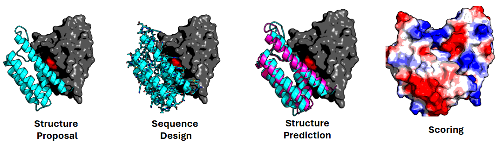

# Australian-Structural-Biology-Computing/bindflow

[](https://github.com/Australian-Structural-Biology-Computing/bindflow/actions/workflows/ci.yml)
[](https://github.com/Australian-Structural-Biology-Computing/bindflow/actions/workflows/linting.yml)[](https://doi.org/10.5281/zenodo.XXXXXXX)
[](https://www.nf-test.com)

[](https://www.nextflow.io/)
[](https://docs.conda.io/en/latest/)
[](https://www.docker.com/)
[](https://sylabs.io/docs/)
[](https://cloud.seqera.io/launch?pipeline=https://github.com/Australian-Structural-Biology-Computing/bindflow)

## Introduction

**Australian-Structural-Biology-Computing/bindflow** is a bioinformatics pipeline that generates protein binders for user-defined hotspot residues on a target protein structure.
The pipeline will be executed until a user-defined number of designs pass the in-silico quality control criteria.

<!-- TODO nf-core:
   Complete this sentence with a 2-3 sentence summary of what types of data the pipeline ingests, a brief overview of the
   major pipeline sections and the types of output it produces. You're giving an overview to someone new
   to nf-core here, in 15-20 seconds. For an example, see https://github.com/nf-core/rnaseq/blob/master/README.md#introduction
-->

<!-- TODO nf-core: Include a figure that guides the user through the major workflow steps. Many nf-core
     workflows use the "tube map" design for that. See https://nf-co.re/docs/contributing/design_guidelines#examples for examples.   -->
<!-- TODO nf-core: Fill in short bullet-pointed list of the default steps in the pipeline -->



Bindflow is a wrapper around the BindCraft tool to allow convenient execution on HPC infrastructure. BindCraft includes 4 core binder design modules within a single tool.
1. Structure proposal (AlphaFold2 hallucination)
2. Sequence design (SolubleMPNN)
3. Structure prediction (AlphaFold2 multimer)
4. Post-design quality control (PyRosetta)
> [!WARNING]
Post-design QC filtering is conducted with PyRosetta. Users must agree to the PyRosetta license terms.

## Usage

> [!NOTE]
> If you are new to Nextflow and nf-core, please refer to [this page](https://nf-co.re/docs/usage/installation) on how to set-up Nextflow. Make sure to [test your setup](https://nf-co.re/docs/usage/introduction#how-to-run-a-pipeline) with `-profile test` before running the workflow on actual data.

<!-- TODO nf-core: Describe the minimum required steps to execute the pipeline, e.g. how to prepare samplesheets.
     Explain what rows and columns represent. For instance (please edit as appropriate):

First, prepare a samplesheet with your input data that looks as follows:

`samplesheet.csv`:

```csv
sample,fastq_1,fastq_2
CONTROL_REP1,AEG588A1_S1_L002_R1_001.fastq.gz,AEG588A1_S1_L002_R2_001.fastq.gz
```

Each row represents a fastq file (single-end) or a pair of fastq files (paired end).

-->
First, prepare a samplesheet with your input data that looks as follows:

`samplesheet.csv`:

```csv
id,binder_name,starting_pdb,chains,target_hotspot_residues,min_length,max_length,number_of_final_designs,settings_advanced,settings_filters
demo,PDL1,PDL1.pdb,A,"56",65,150,10,default_4stage_multimer.json,default_filters.json
```

Each row represents a single design instance. Detailed documentation describing job parameters can be found in the BindCraft [documentation](https://github.com/martinpacesa/BindCraft).
Briefly: 
- **id** is a unique job identifier
- **binder_name** is an identifier for the protein target.
- **starting_pdb** contains the target structure in PDB format.
- **chains** defines the target chains in the starting_pdb.
- **target_hotspot_residues** defines the residue indices of the target_pdb which will be targeted by the design process.
- **min_length** defines the minimum length of the designed binder.
- **max_length** defines the maximum length of the designed binder.
- **number_of_final_designs** defines the number of binders required to pass QC criteria before the job is complete.
- **settings_advanced** defines advanced BindCraft settings (JSON format).
- **settings_filters** defines advanced BindCraft filter settings (JSON format).

Workloads can be distributed over multiple GPUs by setting the --batches <n> command line argument to split the number of final designs in to separate batches.

Now, you can run the pipeline using:

<!-- TODO nf-core: update the following command to include all required parameters for a minimal example -->

```bash
nextflow run Australian-Structural-Biology-Computing/bindflow \
   -profile <docker/singularity/.../institute> \
   --input samplesheet.csv \
   --outdir <OUTDIR>
   --batches 1
```

> [!WARNING]
> Please provide pipeline parameters via the CLI or Nextflow `-params-file` option. Custom config files including those provided by the `-c` Nextflow option can be used to provide any configuration _**except for parameters**_; see [docs](https://nf-co.re/docs/usage/getting_started/configuration#custom-configuration-files).

## Credits

Australian-Structural-Biology-Computing/bindflow was originally written by Ziad Al-Bkhetan.

We thank the following people for their extensive assistance in the development of this pipeline:

<!-- TODO nf-core: If applicable, make list of people who have also contributed -->

## Contributions and Support

If you would like to contribute to this pipeline, please see the [contributing guidelines](.github/CONTRIBUTING.md).

## Citations

<!-- TODO nf-core: Add citation for pipeline after first release. Uncomment lines below and update Zenodo doi and badge at the top of this file. -->
<!-- If you use Australian-Structural-Biology-Computing/bindflow for your analysis, please cite it using the following doi: [10.5281/zenodo.XXXXXX](https://doi.org/10.5281/zenodo.XXXXXX) -->

<!-- TODO nf-core: Add bibliography of tools and data used in your pipeline -->

An extensive list of references for the tools used by the pipeline can be found in the [`CITATIONS.md`](CITATIONS.md) file.

This pipeline uses code and infrastructure developed and maintained by the [nf-core](https://nf-co.re) community, reused here under the [MIT license](https://github.com/nf-core/tools/blob/main/LICENSE).

> **The nf-core framework for community-curated bioinformatics pipelines.**
>
> Philip Ewels, Alexander Peltzer, Sven Fillinger, Harshil Patel, Johannes Alneberg, Andreas Wilm, Maxime Ulysse Garcia, Paolo Di Tommaso & Sven Nahnsen.
>
> _Nat Biotechnol._ 2020 Feb 13. doi: [10.1038/s41587-020-0439-x](https://dx.doi.org/10.1038/s41587-020-0439-x).
